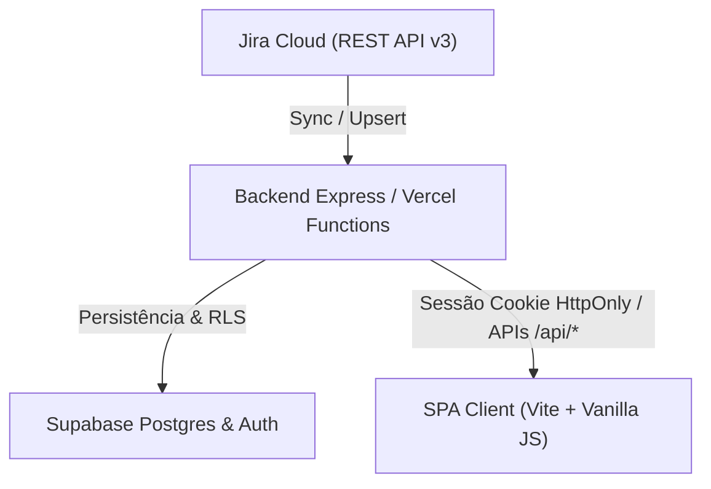

# JiraDash — Documentação Unificada & Guia Completo do Sistema

JiraDash é a plataforma interna da **Antlia** para acompanhamento executivo e operacional dos dados do **Jira Cloud**. O sistema reúne dashboards executivos, indicadores de projetos, relatórios de horas por contrato/analista, visão Kanban, gráfico de Gantt e gestão de acessos baseada em papéis (RBAC).

---

## 1. Ambientes & Stack Tecnológica

### Ambientes Oficiais
* **Produção:** `https://jiradashofc.vercel.app`
* **API Endpoints:** `https://jiradashofc.vercel.app/api/*`
* **Banco de Dados & Autenticação (Supabase):** `https://vzkiniwjhnhfximpfzuk.supabase.co`
* **Desenvolvimento Local:** `http://localhost:5173` (Vite SPA) e `http://localhost:3001` (Backend Express)

### Stack de Tecnologia
* **Frontend:** Vite SPA + JavaScript (ES Modules) + CSS Vanilla.
* **Backend:** Node.js, Express e Vercel Serverless Functions (`/api/*`).
* **Banco de Dados & Auth:** Supabase Auth, Postgres e Row Level Security (RLS).
* **Integração Externa:** Jira Cloud REST API v3.
* **Governança & Qualidade:** Node test runner nativo, ESLint, Git Hooks, GitHub Actions CI, Gitleaks e Sonar.

---

## 2. Visão Geral de Arquitetura e Fluxo de Dados

O JiraDash atua com um fluxo unidirecional: **Jira Cloud -> Backend (Express/Vercel) -> Supabase Postgres -> SPA Client (Vite)**.



### Princípios da Arquitetura:
1. **Jira como Origem Externa:** O Jira é a fonte primária dos dados (somente leitura).
2. **Supabase como Estado Operacional:** As telas e dashboards leem exclusivamente o banco operacional Supabase via APIs locais `/api/*`, garantindo alta performance e isolamento.
3. **Isolamento de Credenciais:** As chaves privilegiadas do Supabase (`SUPABASE_SERVICE_ROLE_KEY`) e os tokens do Jira nunca chegam ao navegador do usuário.

---

## 3. Governança de Código, Travas e Validação (100% Obrigatório)

O projeto aplica uma trava de segurança em 3 camadas que impede commits ou pushes que não estejam 100% aprovados pelo linter e pelos testes:

### 3.1. Travas Locais do Git (`.githooks/`)
* **`pre-commit`:** Executa automaticamente `npm run lint` e `npm test` antes de efetivar qualquer commit.
* **`pre-push`:** Executa `npm run lint`, `npm test` e `npm run build` antes de autorizar o envio ao repositório remoto.
* **Script de Ativação Automática:** O `package.json` contém `"prepare": "git config core.hooksPath .githooks"`. Executar `npm install` ativa as travas automaticamente.

### 3.2. Integração Contínua (GitHub Actions)
O workflow `.github/workflows/ci.yml` executa a validação completa em todos os PRs e pushes para `main` e `develop`:
```bash
npm run lint    # 0 erros e 0 avisos (clean output)
npm test        # 100% das suítes de teste aprovadas
npm run build   # Compilação limpa para produção
npm audit --audit-level=moderate
```

---

## 4. Regras de Negócio e Controle de Acesso (RBAC)

### 4.1. Autenticação e Restrições de Domínio
* **Domínio Padrão:** Permitido apenas e-mails `@antlia.com.br`.
* **Exceção Administrativa:** Contas externas especificadas na variável `AUTH_ADMIN_EXCEPTION_EMAILS`.
* **Confirmação de E-mail:** Acesso exige e-mail confirmado (`email_confirmed_at != null`).
* **Sessão Segura:** Cookies `HttpOnly`, `SameSite=Lax` e `Secure` (em produção).

### 4.2. Perfis de Acesso (`roles`)
* **`full` (Administrador):** Acesso amplo total, único autorizado a gerenciar usuários e acessos (`/api/access/*`).
* **`master` (Gestor Operacional):** Acesso operacional total aos relatórios e dashboards, sem gestão de usuários.
* **`visualizacao` (Leitura):** Leitura dos módulos e relatórios autorizados.
* **`personalizado` (Granular):** Permissões específicas calculadas via view `user_effective_permissions`.

---

## 5. Regras de Sincronização e Criptografia

* **Job de Sincronização:** Sincroniza issues, comentários, changelogs e worklogs. Executado via interface ou agendador automático (cron a cada 30min em `/api/jira/sync/worker`).
* **Criptografia AES-256-GCM:** O token do Jira é criptografado no banco através da chave `JIRA_ENCRYPTION_KEY`.
* **Substituição de Obsoletos:** Dados atualizados ou removidos no Jira são normalizados e atualizados via `upsert` no Supabase.

---

## 6. Regras de Cálculo de Relatórios e Contratos de Horas

### 6.1. Status Mapeados
Os status do Jira são mapeados nas categorias ([src/data/models.js](file:///f:/Projetos/jiradashofc/src/data/models.js)):
* **`todo`:** A Fazer, Backlog, Novo.
* **`in_progress`:** Em Andamento, Em Progresso, Validação, QA.
* **`done`:** Concluído, Done, Fechado.
* **`blocked`:** Bloqueado, Impedido.

### 6.2. Contratos de Horas (Docwise vs. Crawford)
* **Contrato Docwise (`DOCW`):** Horas **cumulativas** entre competências (carry-over de saldo).
* **Contrato Crawford (`CRAWFORD`):** Consumo **mensal sem acúmulo** (reinicia a cada mês civil).
* **Fuso Horário:** A virada de competência/mês utiliza o fuso `America/Sao_Paulo` (BRT/BRST) para evitar incompatibilidades com o fuso UTC.

---

## 7. Variáveis de Ambiente & Segurança

Use `.env.example` como referência. **Nunca versione credenciais**.

### Variáveis Obrigatórias:
```env
AUTH_PROVIDER=supabase
AUTH_REQUIRE_API_AUTH=true
AUTH_REQUIRE_EMAIL_CONFIRMATION=true
AUTH_ALLOWED_DOMAIN=antlia.com.br
AUTH_SESSION_SECRET=<chave-secreta-32-chars>
SUPABASE_URL=https://vzkiniwjhnhfximpfzuk.supabase.co
SUPABASE_ANON_KEY=<anon-key>
SUPABASE_SERVICE_ROLE_KEY=<service-role-key>
JIRA_BASE_URL=https://antlia.atlassian.net
JIRA_EMAIL=<email-jira>
JIRA_API_TOKEN=<token-jira>
JIRA_JQL=project IN (DOCW, CRAWFORD)
JIRA_ENCRYPTION_KEY=<chave-aes-32-chars>
CRON_SECRET=<token-cron>
```

---

## 8. Estrutura de Branches & Release

* **`main`:** Código de produção.
* **`develop`:** Código de desenvolvimento e homologação.

### Processo de Release:
1. Criar branch a partir de `develop`.
2. Implementar e rodar validações locais (`npm run lint`, `npm test`).
3. Abrir PR para `develop` (CI precisa passar).
4. Homologar e abrir PR de `develop` para `main`.

---

## 9. Comandos Úteis & Troubleshooting

### Comandos do Projeto
```bash
npm install        # Instala dependências e ativa Git Hooks (.githooks)
npm run dev:all    # Inicia o servidor local Express (3001) e Vite (5173)
npm test           # Executa os 15 testes unitários nativos do Node
npm run lint       # Executa a verificação do ESLint
npm run build      # Compila o bundle para produção
```

### Smoke Test Rápidos (Servidor em Produção/Staging)
```bash
curl -I https://jiradashofc.vercel.app/                        # Retorna 200
curl -i https://jiradashofc.vercel.app/api/auth                # Retorna 401 (sem sessão)
curl -i https://jiradashofc.vercel.app/api/jira/system/status # Retorna 401 (sem sessão)
```
